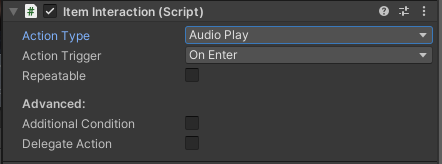
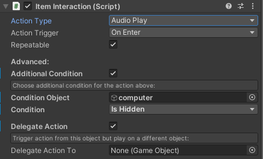

# Item Interaction Component for Unity
Component for basics interactions and very simple game logic.

Just drag-and-drop this component to the object with any kind of collider (isTrigger checkbox has to be selected) and you can choose the interaction type from the list.

# Explaination:

**Action Type:**

Possible actions are:
- Animation Triggers (if the Object has an Animator)
- Hide Object
- Show Object
- Play Audio (if the Object has an AudioSource)
- Stop Audio (if the Object has an AudioSource)
- Play Particles (if the Object has a ParticleSystem)
- Stop Particles (if the Object has a ParticleSystem)

*Note for Animation Triggers: In Animator under "parameters" tab, you can add parameters in type of trigger with names: __enter__, __exit__ and __key__, and then use them in conditions of transitions.*

**Action Trigger:**

You can chose if you want to trigger action when player enter to "collider" or when player exit from "collider" or when player hit key "F" on the keyboard (beeing in range of "collider").

**Repeatable:**

If selected, action will play any time when player enter/leave "collider". In other case it play action once and then is disabled.

**Additional Condition:**

With this option you can create some simple logic. For example you can play animation on one object only when you hide different object before... So the door will open when you collect the key.

**Delegate Action:**

This option is helpful when you want to play selected action on different object.

**Additional Notes:**

You can add many Interaction Components to one object. For example if you want to hide item and play sound, add two of Interaction Components with different settings.

...Hopefully I will add some video examples soon.

# Tutorials:

**Opening/closing gates**

Place a gate into the scene. Create closing and opening animations for this gate. Disable "loop" for animations. For gate game object add "Item Interaction" component and a box collider set as trigger. Setup Animator and that's it. Watch the video:

https://user-images.githubusercontent.com/2020968/200136944-a3c7574f-606f-47a5-aa01-1af11c8931e8.mp4

Let's go one step further...
Adding the gate closing and opening sound. Triggering multiple sounds with a single trigger is a little bit tricky:

https://user-images.githubusercontent.com/2020968/200138284-14fdd396-fdb7-4355-b3b4-552fcbd7b517.mp4

Animation triggers may have an additional condition. For example, we may need a key.

https://user-images.githubusercontent.com/2020968/200139511-2c88534c-234f-488a-8d35-fcee6d057e03.mp4
